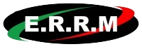

  

   
   

  **L'Excellence en Maintenance Industrielle et Métallerie depuis 1991.**
  
  

   

---

## 🏭 Qui sommes-nous ?

Située à **Villers-Cotterêts** (Aisne), **ERRM** est une entreprise spécialisée dans le travail du métal et la maintenance industrielle. 

Forts de **plus de 30 ans d'expérience**, nous accompagnons les professionnels de l'industrie, de la logistique et de la grande distribution dans la conception, la fabrication et la maintenance de leurs équipements et infrastructures. Avec un atelier de plus de 1000 m², un bureau d'études intégré et 7 véhicules d'intervention, nous garantissons **réactivité, sur-mesure et qualité**.

---

## 🛠️ Nos 5 cœurs de métier

1. 🔧 **Maintenance Industrielle** : Entretien préventif et correctif, réparation et remplacement de pièces mécaniques en milieu industriel en activité.
2. 🗜️ **Chaudronnerie & Tuyauterie** : Conception sur-mesure de cuves, réservoirs et réseaux en acier, inox ou aluminium.
3. 🏗️ **Charpente Métallique** : Planchers techniques, passerelles, extensions, renforcement de structures (en partenariat avec notre bureau d'études).
4. 🚪 **Métallerie & Serrurerie** : Garde-corps, escaliers, portes sécurisées, grilles, cloisons industrielles.
5. 🌬️ **Salle Propre & Ventilation** : Structures étanches, traitement de l'air et réseaux de gaines de ventilation sur-mesure pour environnements exigeants.

---

## 💡 Pourquoi choisir ERRM ?

- **Bureau d'études intégré** (Modélisation 3D, SolidWorks, AutoCAD)
- **Atelier de fabrication** moderne et performant (1000 m²)
- **Équipe qualifiée** (Soudeurs agréés, monteurs spécialisés)
- **Intervention rapide** sur la moitié Nord de la France
- **Gestion globale** : de la conception 3D à la pose sur site

---

## 📸 Découvrez nos réalisations

Consultez notre portfolio en ligne pour découvrir la qualité de notre savoir-faire en images : 

👉 **[Voir notre Galerie de Réalisations](https://errm.fr/realisations.html)**

---

## 📞 Nous contacter

Votre projet prend forme ici. Discutons-en !

- 🌐 **Site Web** : [www.errm.fr](https://errm.fr)
- 📧 **Email** : [contact@errm.fr](mailto:contact@errm.fr)
- 📞 **Standard** : 03 23 96 77 07
- 📍 **Atelier & Siège** : 19 bis rue du Marchoix, 02600 Villers-Cotterêts

 

  <i>© 2026 ERRM SAS — Tous droits réservés.</i>

